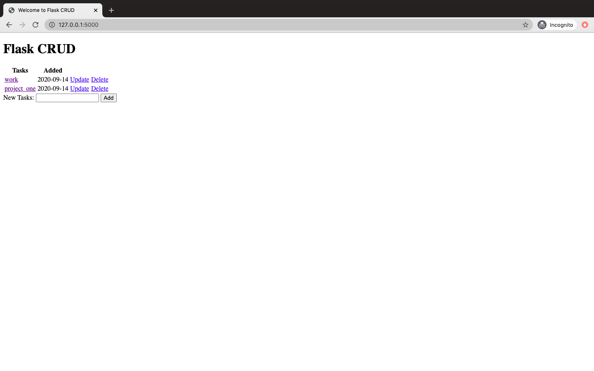

## CRUD_flask
##### The *CRUD application* is used for creating, updating, deleting tasks.
##### HTTP provides a set of methods to work on the resources. These methods are called as HTTP verbs in REST. Some of the methods are:-
* GET - is used for retrieving item. 
* PUT - is used for creating a new item or updating the item if its already present there.
* POST - is used for creating an item.
* DELETE - is used for deleting an item
#### To run the flask application:-
1. Install the libraries in requirements.txt using the command
 `pip install -r requirements.txt`
2. Run the app in the working directory using
 `python app.py`
 
#### This is how the app looks like

